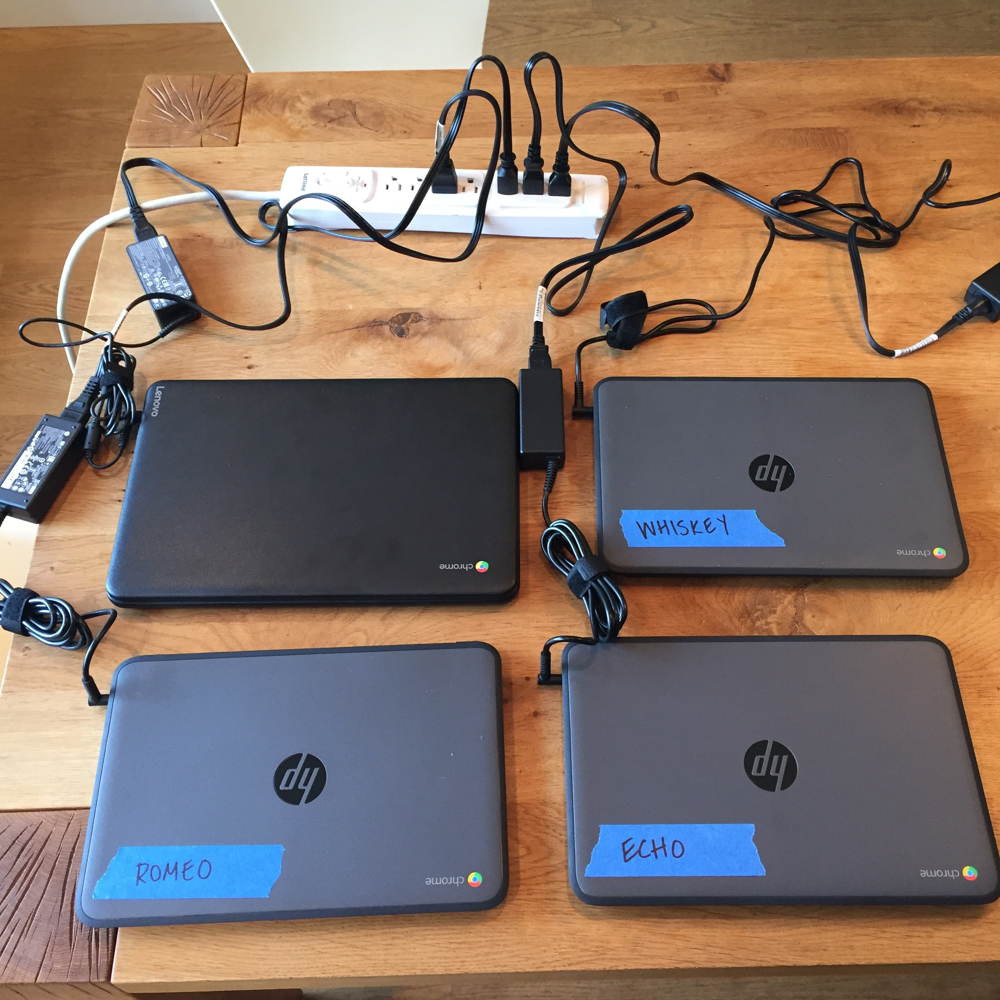
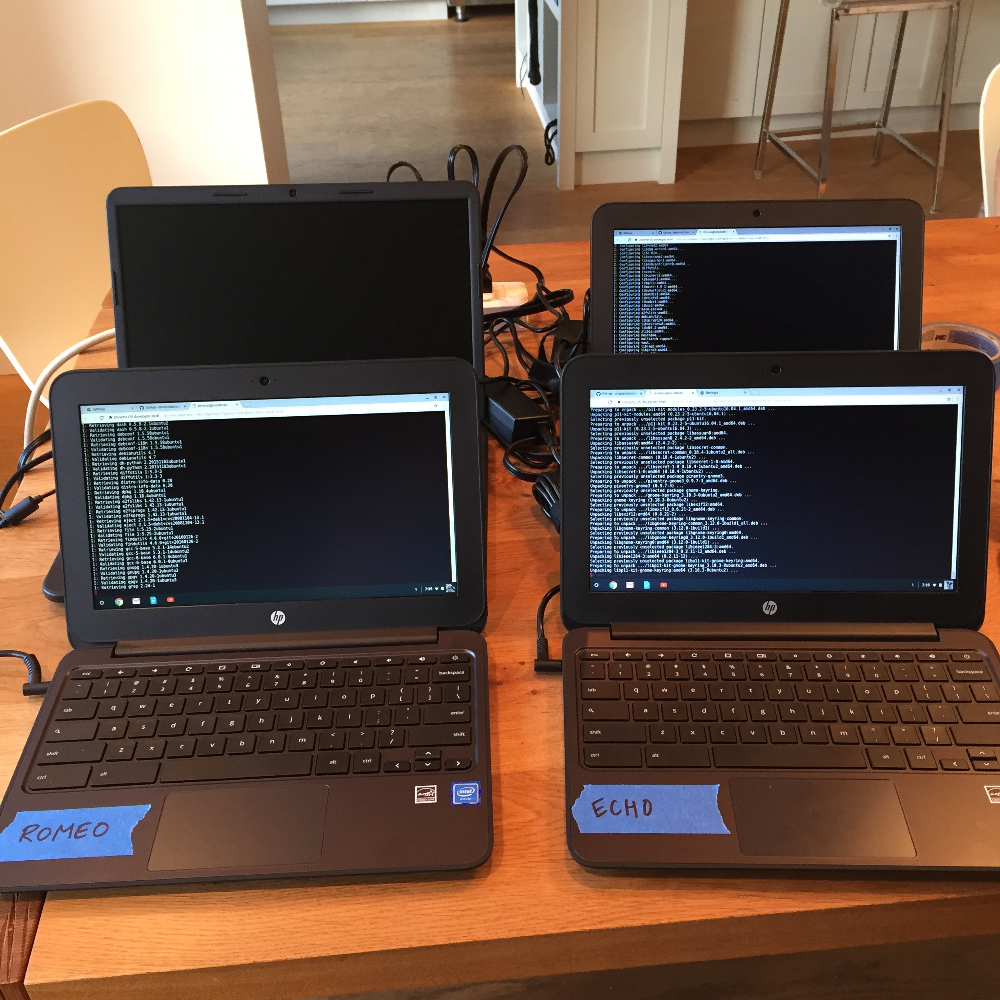
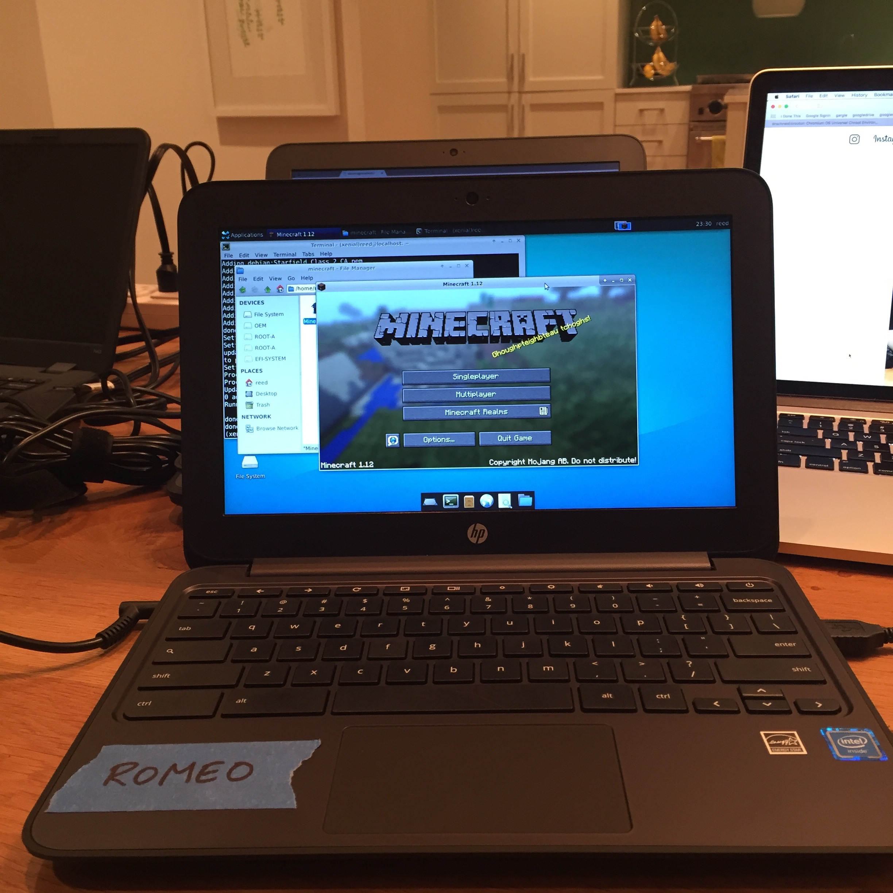

# operation-chromebook

How I set up some Chromebooks for Minecraft and light R use.

### Hardware

  * HP Chromebook 11 G4 EE: Intel Celeron N2840 Dual Core, 11.6" Screen, 4GB RAM, 16GB Internal Storage. Bought for $210 CDN each at [Mike's Computer Shop](https://www.mikescomputershop.com/product/6961387).
    - 3x for kids: `echo`, `romeo`, `whiskey`
  * Lenovo Chromebook N42-20 80US0000US, Intel Celeron N3060, 14" Screen, 4GB RAM, 16GB Flash Memory Capacity. Bought for $190 CDN at [Mike's Computer Shop](https://www.mikescomputershop.com/product/7619358) (special price on a single machine that someone had returned).
    - 1x for me

### Links re: Crouton and Minecraft

  * <http://platypusplatypus.com/chromebooks/play-minecraft-chromebook/>
  * <https://github.com/dnschneid/crouton>
  * <https://github.com/dnschneid/crouton/wiki/crouton-in-a-Chromium-OS-window-%28xiwi%29>

### Live notes for kid Chromebooks

Turn thing on. Sign in with each person's Google account and connect to the network.

Escape + Refresh + Power to reboot. You'll see recovery screen, do not panic. Ctrl + D to enable Developer mode. Yes, OK to wipe everything. Also, do not accept invitation to re-enable OS verification. Just wait that offer out or Ctrl + D to advance. Eventually you'll see "Preparing system for Developer Mode" for 7 - 8 mins. Another screen inviting you to re-enable OS verification. Wait it out or Ctrl + D.

Groundhog Day. Sign in to the Google accounts again and re-connect to the network.

Go to <https://github.com/dnschneid/crouton>. Click the repo's URL to download crouton.

*20/20 hindsight* The HPs somehow did not find the network smoothly enough to update themselves during the first (or second?) boot. At this point, in Chrome, go to `chrome://help` and accept the offer to update the OS and restart. Keep handling invitations to re-enable OS verification as above. This process looked slightly different on all of the HPs. Suspect they were actually not all of the same vintage?

Open a shell with Ctrl+Alt+T and enter `shell`. This will just be a tab in Chrome.

```sh
sudo sh ~/Downloads/crouton -t xfce
```

This took ~17 minutes. Pick a username and password for the Ubuntu side.

Convince self I've actually installed Ubuntu by staring an Xfce session:

```sh
sudo startxfce4
```

Looks good. Cycle between ChromeOS and the running chroot with Ctrl+Alt+Shift+Back and Ctrl+Alt+Shift+Forward. Note these are the arrows up with the function keys, not the ones in the lower right corner. To truly exit the chroot, log out of Xfce.

On Ubuntu, make sure everything up-to-date and install JRE:

```
sudo apt-get update
sudo apt-get upgrade
sudo apt-get install default-jre
```

Install Minecraft. On the ChromeOS side, download the `.jar` by selecting linux from the [official download page](https://minecraft.net/en-us/download/).

Back to Ubuntu now.

```
mkdir games
mkdir games/minecraft
cp ~/Downloads/Minecraft.jar games/minecraft/
chmod a+x games/minecraft/Minecraft.jar
```

Launch it!

*OK, yeah, it didn't actually go quite this smoothly, but by the time I got to the 3rd Chromebook, I had worked out the above.*




<p style="clear: both;">

### Links re: R and RStudio

  * <http://www.datascienceriot.com//r/install-ubuntu16/>
  * <https://mikewilliamson.wordpress.com/2016/11/14/installing-r-studio-on-ubuntu-16-10/>
  * <https://jwhollister.com/r/2017/04/14/chromebook-4-rstats.html>

### Live notes for Jenny Chromebook

The beginning is like for kids above. But I encrypt my chroot.

```sh
sudo sh ~/Downloads/crouton -e -t xfce
```

Set locale. For the second step affirm / choose `en_US.UTF-8` at all opportunities.

```sh
sudo locale-gen "en_US.UTF-8"
sudo dpkg-reconfigure locales
```

Add RStudio CRAN repository.

```sh
sudo echo "deb http://cran.rstudio.com/bin/linux/ubuntu xenial/" | sudo tee -a /etc/apt/sources.list
```

Add R to Ubuntu Keyring.

```sh
gpg --keyserver keyserver.ubuntu.com --recv-key E084DAB9
gpg -a --export E084DAB9 | sudo apt-key add -
```

Install R.

```sh
sudo apt-get update
sudo apt-get install r-base r-base-dev
```

Install old Gstreamer, because RStudio requires. Set things up so Ubuntu does not "helpfully" upgrade these. Note these versions are different from those that appear in the linked posts I'm using for reference.

```
wget http://ftp.ca.debian.org/debian/pool/main/g/gstreamer0.10/libgstreamer0.10-0_0.10.36-1.5_amd64.deb
wget http://ftp.ca.debian.org/debian/pool/main/g/gst-plugins-base0.10/libgstreamer-plugins-base0.10-0_0.10.36-2_amd64.deb
sudo dpkg -i libgstreamer0.10-0_0.10.36-1.5_amd64.deb
sudo dpkg -i libgstreamer-plugins-base0.10-0_0.10.36-2_amd64.deb
sudo apt-mark hold libgstreamer-plugins-base0.10-0
sudo apt-mark hold libgstreamer0.10
sudo apt-mark showhold
```

You'll gradually discover you need to manually install various libraries as you install and use more packages. So far I've done:

```sh
sudo apt-get install libjpeg62
sudo apt-get install libxslt1-dev
sudo apt-get install libssl-dev
sudo apt-get install libcurl4-openssl-dev
sudo apt-get install libssh2-1-dev
sudo apt-get install pandoc
sudo apt-get install texlive-latex-base
sudo apt-get install qpdf
```

Download RStudio IDE daily build and install. This version number will be a moving target, so go to the [download page for the dailies](https://dailies.rstudio.com) to see what's the latest (just look at the line of buttons across the top).

```
wget https://s3.amazonaws.com/rstudio-dailybuilds/rstudio-1.1.299-amd64.deb
sudo dpkg -i rstudio-1.1.299-amd64.deb
```

Launch via `rstudio`.

#### Ongoing maintenance

January 2018 updates:

  * after not using for a while, tried to launch via Ctrl+Alt+T, `shell`, `sudo startxfce4` but wow much error
  * therefore, in that shell on Chrome side: `sudo sh ~/Downloads/crouton -u -n xenial` ... great deal of updating (on the order of an hour)
  * now success with `sudo startxfce4`
  * in shell on Ubuntu: `sudo apt-get update` (nothing needed to be done, apparently previous command accomplished?)
  * Re-install RStudio daily (version has changed, of course) ... oops can't launch via `rstudio`
  * `sudo apt-get install libnss3` ... now I can launch rstudio
  * updated packages *en masse*
